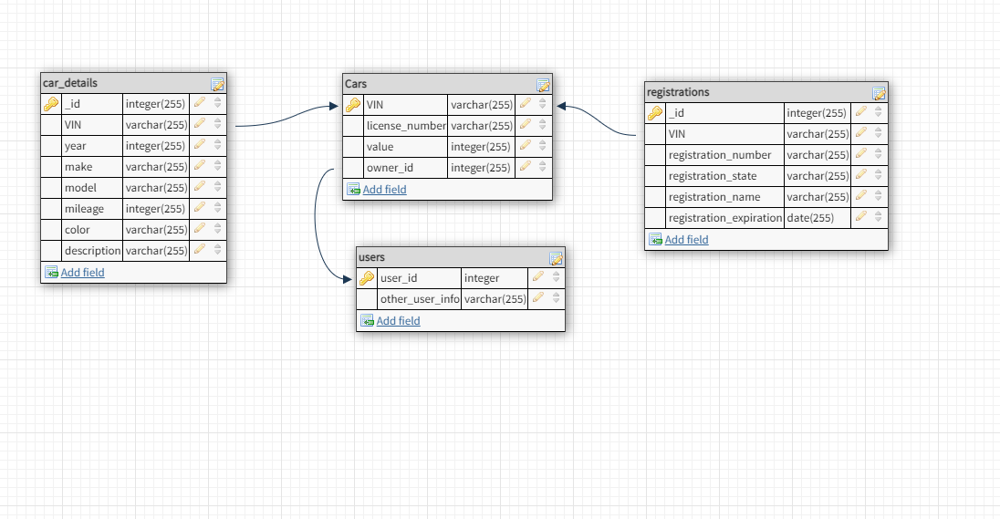

# Assumptions & Notes:

- server side data validation is in place, all input is good to go
- registration expiration should be updated on the front end to be the same as the db format (YYYY-MM-DD), but if not we can easily manipulate that

- sample of how incoming data will look --> endpoint http://localhost:3000/cars/:VIN

```json

{
    "license": "ABC123",
    "registrationNumber": "R123456",
    "registrationState": "California",
    "registrationExpiration": "2023-08-29",
    "registrationName": "Hannah Santoyo",
    "value": 60000,
    "mileage": 16574,
    "description": "test description",
    "color": "white"
}
```

- data is all in one table for the sake of time but I've included a diagram of one possible way the database can be organized for scaling purposes




## How to start server:

- npm install
- npm run dev
